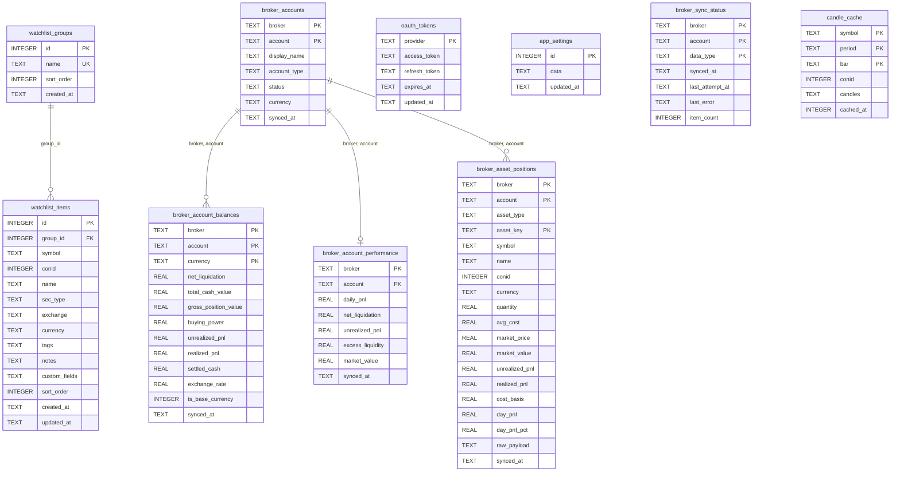

# Traio 数据库表结构

Traio 使用 **SQLite** 作为本地持久化存储，默认路径为 `{baseDir}/data/traio.db`。

- 引擎：`modernc.org/sqlite`（纯 Go 实现）
- 迁移入口：`internal/store/store.go` → `migrate()`
- 连接配置：`PRAGMA foreign_keys = ON`、`PRAGMA journal_mode = WAL`
- 单连接模式：`MaxOpenConns(1)` / `MaxIdleConns(1)`，确保 PRAGMA 全局生效

---

## 表一览

| 表名 | 用途 |
|------|------|
| `watchlist_groups` | 自选股分组 |
| `watchlist_items` | 自选股条目 |
| `oauth_tokens` | OAuth 访问令牌（按 provider 存储） |
| `app_settings` | 应用配置（单行 JSON） |
| `broker_accounts` | 券商账户投影 |
| `broker_account_balances` | 券商账户当前余额投影（按币种） |
| `broker_account_performance` | 券商账户当日盈亏投影 |
| `broker_asset_positions` | 券商资产持仓投影 |
| `broker_sync_status` | 券商/账户/数据类型维度的最新同步状态 |
| `candle_cache` | K 线数据缓存 |

---

## ER 关系图


```mermaid
erDiagram
    watchlist_groups ||--o{ watchlist_items : "group_id"
    broker_accounts ||--o{ broker_account_balances : "broker, account"
    broker_accounts ||--o| broker_account_performance : "broker, account"
    broker_accounts ||--o{ broker_asset_positions : "broker, account"

    watchlist_groups {
        INTEGER id PK
        TEXT name UK
        INTEGER sort_order
        TEXT created_at
    }

    watchlist_items {
        INTEGER id PK
        INTEGER group_id FK
        TEXT symbol
        INTEGER conid
        TEXT name
        TEXT sec_type
        TEXT exchange
        TEXT currency
        TEXT tags
        TEXT notes
        TEXT custom_fields
        INTEGER sort_order
        TEXT created_at
        TEXT updated_at
    }

    oauth_tokens {
        TEXT provider PK
        TEXT access_token
        TEXT refresh_token
        TEXT expires_at
        TEXT updated_at
    }

    app_settings {
        INTEGER id PK
        TEXT data
        TEXT updated_at
    }

    broker_accounts {
        TEXT broker PK
        TEXT account PK
        TEXT display_name
        TEXT account_type
        TEXT status
        TEXT currency
        TEXT synced_at
    }

    broker_account_balances {
        TEXT broker PK
        TEXT account PK
        TEXT currency PK
        REAL net_liquidation
        REAL total_cash_value
        REAL gross_position_value
        REAL buying_power
        REAL unrealized_pnl
        REAL realized_pnl
        REAL settled_cash
        REAL exchange_rate
        INTEGER is_base_currency
        TEXT synced_at
    }

    broker_account_performance {
        TEXT broker PK
        TEXT account PK
        REAL daily_pnl
        REAL net_liquidation
        REAL unrealized_pnl
        REAL excess_liquidity
        REAL market_value
        TEXT synced_at
    }

    broker_asset_positions {
        TEXT broker PK
        TEXT account PK
        TEXT asset_type
        TEXT asset_key PK
        TEXT symbol
        TEXT name
        INTEGER conid
        TEXT currency
        REAL quantity
        REAL avg_cost
        REAL market_price
        REAL market_value
        REAL unrealized_pnl
        REAL realized_pnl
        REAL cost_basis
        REAL day_pnl
        REAL day_pnl_pct
        TEXT raw_payload
        TEXT synced_at
    }

    broker_sync_status {
        TEXT broker PK
        TEXT account PK
        TEXT data_type PK
        TEXT synced_at
        TEXT last_attempt_at
        TEXT last_error
        INTEGER item_count
    }

    candle_cache {
        TEXT symbol PK
        TEXT period PK
        TEXT bar PK
        INTEGER conid
        TEXT candles
        INTEGER cached_at
    }
```

---

## watchlist_groups

自选股分组表。

| 列名 | 类型 | 约束 | 默认值 | 说明 |
|------|------|------|--------|------|
| `id` | INTEGER | PRIMARY KEY, AUTOINCREMENT | — | 分组 ID |
| `name` | TEXT | NOT NULL, UNIQUE | — | 分组名称 |
| `sort_order` | INTEGER | NOT NULL | `0` | 排序权重 |
| `created_at` | TEXT | NOT NULL | `datetime('now')` | 创建时间（SQLite datetime 字符串） |

**初始数据：**

```sql
INSERT OR IGNORE INTO watchlist_groups (id, name, sort_order) VALUES (1, '默认', 0);
```

---

## watchlist_items

自选股条目表。基础结构在 `migrate()` 中创建，部分列通过 `ensureWatchlistItemColumns()` 增量迁移添加（兼容旧库）。

| 列名 | 类型 | 约束 | 默认值 | 说明 |
|------|------|:-----|--------|------|
| `id` | INTEGER | PRIMARY KEY, AUTOINCREMENT | — | 条目 ID |
| `group_id` | INTEGER | NOT NULL, FK → `watchlist_groups(id)` ON DELETE CASCADE | — | 所属分组 |
| `symbol` | TEXT | NOT NULL | — | 标的代码 |
| `conid` | INTEGER | NOT NULL | `0` | 合约 ID（IBKR 等） |
| `name` | TEXT | NOT NULL | `''` | 标的名称 |
| `sec_type` | TEXT | NOT NULL | `''` | 证券类型（如 STK、OPT） |
| `exchange` | TEXT | NOT NULL | `''` | 交易所 |
| `currency` | TEXT | NOT NULL | `''` | 计价货币 |
| `tags` | TEXT | NOT NULL | `'[]'` | 标签 JSON 数组 |
| `notes` | TEXT | NOT NULL | `''` | 备注 |
| `custom_fields` | TEXT | NOT NULL | `'{}'` | 自定义字段 JSON 对象 |
| `sort_order` | INTEGER | NOT NULL | `0` | 组内排序 |
| `created_at` | TEXT | NOT NULL | `datetime('now')` | 创建时间 |
| `updated_at` | TEXT | NOT NULL | `''` | 最后更新时间 |

**唯一约束：** `UNIQUE(group_id, symbol)` — 同一分组内 symbol 不可重复。

**对应 Go 类型：** `store.WatchlistItem`

---

## oauth_tokens

OAuth 令牌存储，按 provider 维度单行保存。

| 列名 | 类型 | 约束 | 默认值 | 说明 |
|------|------|------|--------|------|
| `provider` | TEXT | PRIMARY KEY | — | 提供方标识（如 schwab、ibkr） |
| `access_token` | TEXT | NOT NULL | — | 访问令牌 |
| `refresh_token` | TEXT | 可空 | — | 刷新令牌 |
| `expires_at` | TEXT | 可空 | — | 过期时间（RFC3339Nano） |
| `updated_at` | TEXT | NOT NULL | `datetime('now')` | 最后更新时间 |

**对应 Go 类型：** `store.OAuthToken`

---

## app_settings

应用配置表，固定单行（`id = 1`），`data` 列存储完整 `config.Config` 的 JSON 序列化结果。

| 列名 | 类型 | 约束 | 默认值 | 说明 |
|------|------|------|--------|------|
| `id` | INTEGER | PRIMARY KEY, CHECK (`id = 1`) | — | 固定为 1 |
| `data` | TEXT | NOT NULL | — | 配置 JSON |
| `updated_at` | TEXT | NOT NULL | `datetime('now')` | 最后保存时间 |

**读写入口：** `internal/store/settings.go`、`internal/settings/manager.go`

---

## broker_accounts

券商账户投影，由券商账户同步任务更新。

| 列名 | 类型 | 约束 | 默认值 | 说明 |
|------|------|------|--------|------|
| `broker` | TEXT | PRIMARY KEY（复合） | — | 券商名称（大写，如 IBKR） |
| `account` | TEXT | PRIMARY KEY（复合） | `''` | 账户 ID |
| `display_name` | TEXT | NOT NULL | `''` | 账户展示名称或别名 |
| `account_type` | TEXT | NOT NULL | `''` | 券商账户类型 |
| `status` | TEXT | NOT NULL | `''` | 标准化账户状态 |
| `currency` | TEXT | NOT NULL | `''` | 账户主货币 |
| `synced_at` | TEXT | NOT NULL | — | 最后同步时间（RFC3339 UTC） |

**主键：** `(broker, account)`

---

## broker_account_balances

券商账户的当前余额投影。一个账户可以按币种保存多行余额，账户身份和证券持仓分别由 `broker_accounts` 与 `broker_asset_positions` 管理。

| 列名 | 类型 | 约束 | 默认值 | 说明 |
|------|------|------|--------|------|
| `broker` | TEXT | PRIMARY KEY（复合） | — | 券商名称 |
| `account` | TEXT | PRIMARY KEY（复合） | `''` | 账户 ID |
| `currency` | TEXT | PRIMARY KEY（复合） | `''` | 余额币种或账户基础币种 |
| `net_liquidation` | REAL | NOT NULL | `0` | 账户净清算价值 |
| `total_cash_value` | REAL | NOT NULL | `0` | 现金总值 |
| `gross_position_value` | REAL | NOT NULL | `0` | 持仓总市值 |
| `buying_power` | REAL | NOT NULL | `0` | 可用购买力，可能包含融资额度 |
| `unrealized_pnl` | REAL | NOT NULL | `0` | 未实现盈亏 |
| `realized_pnl` | REAL | NOT NULL | `0` | 已实现盈亏 |
| `settled_cash` | REAL | NOT NULL | `0` | 已结算现金 |
| `exchange_rate` | REAL | NOT NULL | `0` | 相对账户基础币种汇率 |
| `is_base_currency` | INTEGER | NOT NULL | `0` | 是否为 IBKR `BASE` 汇总行 |
| `synced_at` | TEXT | NOT NULL | — | 最后同步时间（RFC3339 UTC） |

**主键：** `(broker, account, currency)`

**外键：** `(broker, account)` → `broker_accounts(broker, account)` ON DELETE CASCADE

---

## broker_account_performance

券商账户当前交易日的盈亏与流动性快照。

| 列名 | 类型 | 约束 | 默认值 | 说明 |
|------|------|------|--------|------|
| `broker` | TEXT | PRIMARY KEY（复合） | — | 券商名称 |
| `account` | TEXT | PRIMARY KEY（复合） | `''` | 账户 ID |
| `daily_pnl` | REAL | NOT NULL | `0` | 当日盈亏 |
| `net_liquidation` | REAL | NOT NULL | `0` | 净清算价值 |
| `unrealized_pnl` | REAL | NOT NULL | `0` | 未实现盈亏 |
| `excess_liquidity` | REAL | NOT NULL | `0` | 超额流动性 |
| `market_value` | REAL | NOT NULL | `0` | 市场价值 |
| `synced_at` | TEXT | NOT NULL | — | 最后同步时间（RFC3339 UTC） |

**外键：** `(broker, account)` → `broker_accounts(broker, account)` ON DELETE CASCADE

---

## broker_asset_positions

券商资产持仓投影。现金、股票、期权、加密货币等都可以作为资产行存储；同一资产在不同券商或不同账户中通过 `(broker, account, asset_key)` 独立记录。

| 列名 | 类型 | 约束 | 默认值 | 说明 |
|------|------|------|--------|------|
| `broker` | TEXT | PRIMARY KEY（复合） | — | 券商名称 |
| `account` | TEXT | PRIMARY KEY（复合） | `''` | 账户 ID |
| `asset_type` | TEXT | NOT NULL | — | 资产类型，如 `cash`、`security` |
| `asset_key` | TEXT | PRIMARY KEY（复合） | — | 稳定资产标识，如 `cash:USD`、`security:conid:265598` |
| `symbol` | TEXT | NOT NULL | `''` | 展示/查询代码 |
| `name` | TEXT | NOT NULL | `''` | 资产名称 |
| `conid` | INTEGER | — | `NULL` | 合约 ID；无则为空 |
| `currency` | TEXT | NOT NULL | `''` | 计价货币 |
| `quantity` | REAL | NOT NULL | — | 持有数量或现金余额 |
| `avg_cost` | REAL | — | `NULL` | 平均成本；现金等不适用时为空 |
| `market_price` | REAL | — | `NULL` | 市价 |
| `market_value` | REAL | NOT NULL | `0` | 市值 |
| `unrealized_pnl` | REAL | — | `NULL` | 未实现盈亏；不适用时为空 |
| `realized_pnl` | REAL | — | `NULL` | 已实现盈亏；不适用时为空 |
| `cost_basis` | REAL | — | `NULL` | 成本基础 |
| `day_pnl` | REAL | — | `NULL` | 当日盈亏 |
| `day_pnl_pct` | REAL | — | `NULL` | 当日盈亏比例 |
| `raw_payload` | TEXT | — | `NULL` | 券商原始 JSON，便于排查字段差异 |
| `synced_at` | TEXT | NOT NULL | — | 同步时间（RFC3339 UTC） |

**主键：** `(broker, account, asset_key)`

**外键：** `(broker, account)` → `broker_accounts(broker, account)` ON DELETE CASCADE

**索引：**

```sql
CREATE INDEX IF NOT EXISTS idx_broker_asset_positions_symbol
    ON broker_asset_positions (symbol);

CREATE INDEX IF NOT EXISTS idx_broker_asset_positions_asset_key
    ON broker_asset_positions (asset_key);
```

**对应 Go 类型：** `store.BrokerAssetPosition`

---

## broker_sync_status

每个券商、账户和数据类型的最新同步状态。账户发现属于券商级资源，使用空
`account`；账户详情、现金、持仓和当日盈亏使用实际账户 ID。

| 列名 | 类型 | 约束 | 默认值 | 说明 |
|------|------|------|--------|------|
| `broker` | TEXT | PRIMARY KEY（复合） | — | 券商名称 |
| `account` | TEXT | PRIMARY KEY（复合） | `''` | 账户 ID；账户发现记录为空 |
| `data_type` | TEXT | PRIMARY KEY（复合） | — | `accounts`、`account_details`、`cash_balances`、`positions` 或 `daily_performance` |
| `synced_at` | TEXT | NOT NULL | `''` | 该数据类型上次成功同步时间 |
| `last_attempt_at` | TEXT | NOT NULL | — | 上次尝试时间 |
| `last_error` | TEXT | NOT NULL | `''` | 上次错误信息；成功时清空 |
| `item_count` | INTEGER | NOT NULL | `0` | 上次成功同步的数据条数 |

**主键：** `(broker, account, data_type)`

**对应 Go 类型：** `store.BrokerSyncStatus`

---

## candle_cache

K 线数据本地缓存，按 `(symbol, period, bar)` 维度存储，TTL 在应用层按 bar 大小判定。

| 列名 | 类型 | 约束 | 默认值 | 说明 |
|------|------|------|--------|------|
| `symbol` | TEXT | PRIMARY KEY（复合） | — | 标的代码 |
| `period` | TEXT | PRIMARY KEY（复合） | — | 时间范围（如 `1d`、`1m`、`1y`） |
| `bar` | TEXT | PRIMARY KEY（复合） | — | K 线周期（如 `1min`、`1h`、`1d`） |
| `conid` | INTEGER | NOT NULL | — | 合约 ID |
| `candles` | TEXT | NOT NULL | — | K 线 JSON 数组 |
| `cached_at` | INTEGER | NOT NULL | — | 缓存写入时间（Unix 秒） |

**主键：** `(symbol, period, bar)`

**`candles` JSON 元素结构（`broker.Candle`）：**

```json
{
  "time": 1719000000,
  "open": 100.0,
  "high": 101.5,
  "low": 99.5,
  "close": 101.0,
  "volume": 1234567
}
```

**缓存 TTL 规则（应用层，`candleTTL()`）：**

| bar 类型 | TTL |
|----------|-----|
| `1d`、`1w`、`1m` | 24 小时 |
| `1h`、`2h`、`4h` | 1 小时 |
| 其他（如 `5min`、`15min`） | 15 分钟 |

**迁移入口：** `internal/store/candle_cache.go` → `ensureCandleCache()`

---

## 完整 DDL

以下为当前代码中的完整建表语句（含索引），`watchlist_items` 已合并增量迁移列。

```sql
-- PRAGMA foreign_keys = ON;
-- PRAGMA journal_mode = WAL;

CREATE TABLE IF NOT EXISTS watchlist_groups (
    id INTEGER PRIMARY KEY AUTOINCREMENT,
    name TEXT NOT NULL UNIQUE,
    sort_order INTEGER NOT NULL DEFAULT 0,
    created_at TEXT NOT NULL DEFAULT (datetime('now'))
);

CREATE TABLE IF NOT EXISTS watchlist_items (
    id INTEGER PRIMARY KEY AUTOINCREMENT,
    group_id INTEGER NOT NULL REFERENCES watchlist_groups(id) ON DELETE CASCADE,
    symbol TEXT NOT NULL,
    conid INTEGER NOT NULL DEFAULT 0,
    name TEXT NOT NULL DEFAULT '',
    sec_type TEXT NOT NULL DEFAULT '',
    exchange TEXT NOT NULL DEFAULT '',
    currency TEXT NOT NULL DEFAULT '',
    tags TEXT NOT NULL DEFAULT '[]',
    notes TEXT NOT NULL DEFAULT '',
    custom_fields TEXT NOT NULL DEFAULT '{}',
    sort_order INTEGER NOT NULL DEFAULT 0,
    created_at TEXT NOT NULL DEFAULT (datetime('now')),
    updated_at TEXT NOT NULL DEFAULT '',
    UNIQUE(group_id, symbol)
);

CREATE TABLE IF NOT EXISTS oauth_tokens (
    provider TEXT PRIMARY KEY,
    access_token TEXT NOT NULL,
    refresh_token TEXT,
    expires_at TEXT,
    updated_at TEXT NOT NULL DEFAULT (datetime('now'))
);

CREATE TABLE IF NOT EXISTS app_settings (
    id INTEGER PRIMARY KEY CHECK (id = 1),
    data TEXT NOT NULL,
    updated_at TEXT NOT NULL DEFAULT (datetime('now'))
);

CREATE TABLE IF NOT EXISTS broker_accounts (
    broker TEXT NOT NULL,
    account TEXT NOT NULL DEFAULT '',
    display_name TEXT NOT NULL DEFAULT '',
    account_type TEXT NOT NULL DEFAULT '',
    status TEXT NOT NULL DEFAULT '',
    currency TEXT NOT NULL DEFAULT '',
    synced_at TEXT NOT NULL,
    PRIMARY KEY (broker, account)
);

CREATE TABLE IF NOT EXISTS broker_account_balances (
    broker TEXT NOT NULL,
    account TEXT NOT NULL DEFAULT '',
    currency TEXT NOT NULL DEFAULT '',
    net_liquidation REAL NOT NULL DEFAULT 0,
    total_cash_value REAL NOT NULL DEFAULT 0,
    gross_position_value REAL NOT NULL DEFAULT 0,
    buying_power REAL NOT NULL DEFAULT 0,
    unrealized_pnl REAL NOT NULL DEFAULT 0,
    realized_pnl REAL NOT NULL DEFAULT 0,
    settled_cash REAL NOT NULL DEFAULT 0,
    exchange_rate REAL NOT NULL DEFAULT 0,
    is_base_currency INTEGER NOT NULL DEFAULT 0,
    synced_at TEXT NOT NULL,
    PRIMARY KEY (broker, account, currency),
    FOREIGN KEY (broker, account) REFERENCES broker_accounts (broker, account)
        ON DELETE CASCADE
);

CREATE TABLE IF NOT EXISTS broker_account_performance (
    broker TEXT NOT NULL,
    account TEXT NOT NULL DEFAULT '',
    daily_pnl REAL NOT NULL DEFAULT 0,
    net_liquidation REAL NOT NULL DEFAULT 0,
    unrealized_pnl REAL NOT NULL DEFAULT 0,
    excess_liquidity REAL NOT NULL DEFAULT 0,
    market_value REAL NOT NULL DEFAULT 0,
    synced_at TEXT NOT NULL,
    PRIMARY KEY (broker, account),
    FOREIGN KEY (broker, account) REFERENCES broker_accounts (broker, account)
        ON DELETE CASCADE
);

CREATE TABLE IF NOT EXISTS broker_asset_positions (
    broker TEXT NOT NULL,
    account TEXT NOT NULL DEFAULT '',
    asset_type TEXT NOT NULL,
    asset_key TEXT NOT NULL,
    symbol TEXT NOT NULL DEFAULT '',
    name TEXT NOT NULL DEFAULT '',
    conid INTEGER,
    currency TEXT NOT NULL DEFAULT '',
    quantity REAL NOT NULL,
    avg_cost REAL,
    market_price REAL,
    market_value REAL NOT NULL DEFAULT 0,
    unrealized_pnl REAL,
    realized_pnl REAL,
    cost_basis REAL,
    day_pnl REAL,
    day_pnl_pct REAL,
    raw_payload TEXT,
    synced_at TEXT NOT NULL,
    PRIMARY KEY (broker, account, asset_key),
    FOREIGN KEY (broker, account) REFERENCES broker_accounts (broker, account)
        ON DELETE CASCADE
);

CREATE INDEX IF NOT EXISTS idx_broker_asset_positions_symbol
    ON broker_asset_positions (symbol);

CREATE INDEX IF NOT EXISTS idx_broker_asset_positions_asset_key
    ON broker_asset_positions (asset_key);

CREATE TABLE IF NOT EXISTS broker_sync_status (
    broker TEXT NOT NULL,
    account TEXT NOT NULL DEFAULT '',
    data_type TEXT NOT NULL,
    synced_at TEXT NOT NULL DEFAULT '',
    last_attempt_at TEXT NOT NULL,
    last_error TEXT NOT NULL DEFAULT '',
    item_count INTEGER NOT NULL DEFAULT 0,
    PRIMARY KEY (broker, account, data_type)
);

CREATE TABLE IF NOT EXISTS candle_cache (
    symbol    TEXT    NOT NULL,
    conid     INTEGER NOT NULL,
    period    TEXT    NOT NULL,
    bar       TEXT    NOT NULL,
    candles   TEXT    NOT NULL,
    cached_at INTEGER NOT NULL,
    PRIMARY KEY (symbol, period, bar)
);

-- 初始种子数据
INSERT OR IGNORE INTO watchlist_groups (id, name, sort_order) VALUES (1, '默认', 0);
```

---

## 源码索引

| 文件 | 内容 |
|------|------|
| `internal/store/store.go` | 主迁移、watchlist CRUD |
| `internal/store/account_balances.go` | 券商账户余额投影读写 |
| `internal/store/candle_cache.go` | K 线缓存表及读写 |
| `internal/store/settings.go` | `app_settings` 读写 |
| `internal/store/oauth_tokens.go` | `oauth_tokens` 读写 |
| `internal/store/positions.go` | 券商持仓读写 |
| `internal/store/sync_status.go` | 分账户、分数据类型同步状态读写 |
