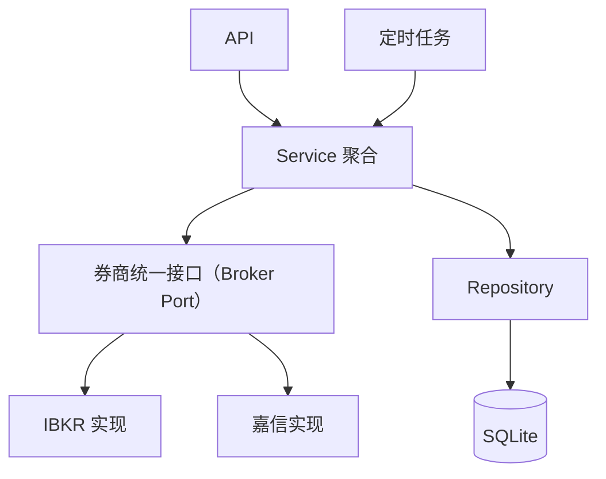

# Traio 服务端架构

本文档描述 Traio 服务端的高层分层结构。API 和定时任务作为系统入口，统一调用 Service 聚合层；Service 通过券商统一接口访问不同券商实现，并通过 Repository 持久化到 SQLite。

## 架构图

## 分层职责

- **入口层**：API 处理外部请求，定时任务触发周期性业务流程。
- **Service 聚合层**：负责业务规则、用例编排和券商数据标准化。
- **券商适配层**：通过统一接口隔离 IBKR、嘉信等券商 API 的差异。
- **持久化层**：通过 Repository 统一访问 SQLite，避免业务逻辑直接依赖数据库实现。
